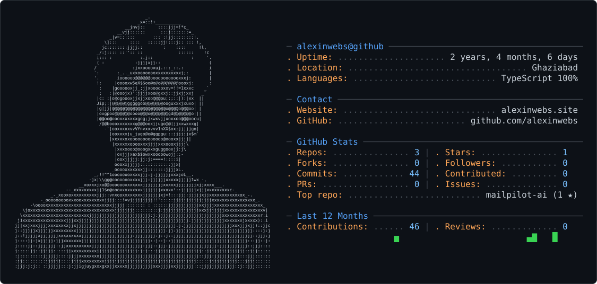

<picture>
  <source media="(prefers-color-scheme: dark)" srcset="dark_mode.svg" />
  <source media="(prefers-color-scheme: light)" srcset="light_mode.svg" />
  
</picture>

<h1 align="center">🕷️ Hey, I'm Abbas 👋</h1>
<h3 align="center">AI-assisted full-stack developer building real, working products</h3>

  

  Turning ideas into working products with AI + full-stack engineering. 
  Based in Ghaziabad, India.

## 🌐 Connect with me

## 💻 Tech Stack

**Languages & Core**  

**Backend & Frameworks**  

**Data & Infra**  

**Tools**  

## 📊 GitHub Stats

  
  

  

